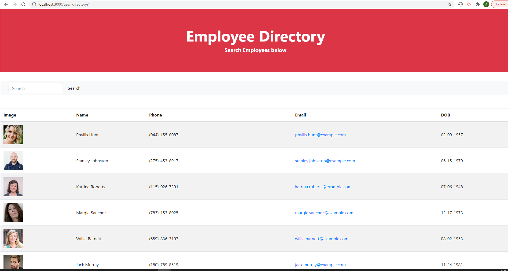
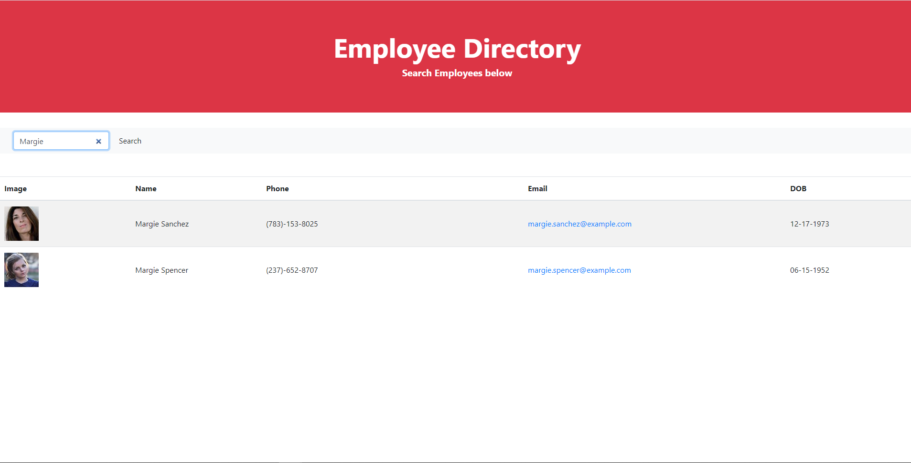

# User Directory
## Description
This React app lets users be able to view their entire employee directory at once so that they have quick access to the employees information. The user can sort the employees by decending or ascending by clicking the name column of the table. The user can also search for employees using the search box and the table will update with every property the user types in.

*https://github.com/AmandaLN/user_directory

*

## Technologies
HTML

CSS/Bootstrap

JavaScript

React

## Usage

## Maintainer
Amanda Nelson

## License
[MIT](https://choosealicense.com/licenses/mit/)